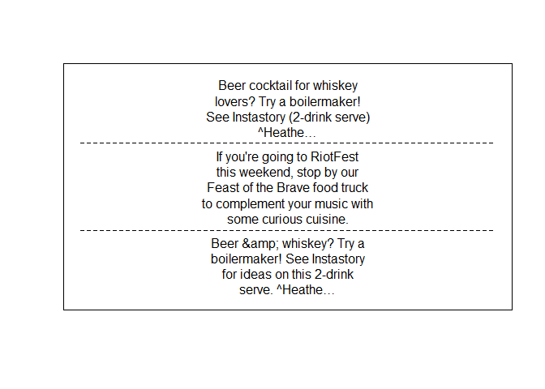
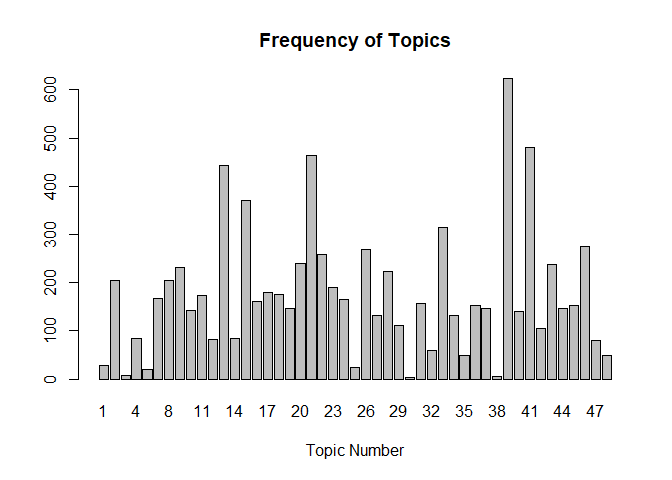

Text Analyis
================

Your mission
============

Perform text analysis.

Okay, I need more information
-----------------------------

Perform sentiment analysis or topic modeling using text analysis methods as demonstrated in the pre-class work and in the readings.

Okay, I need even more information.
-----------------------------------

Do the above. Can't think of a data source?

-   `gutenbergr`
-   `AssociatedPress` from the `topicmodels` package
-   `NYTimes` or `USCongress` from the `RTextTools` package
-   Harry Potter Complete 7 Books text

``` r
if (packageVersion("devtools") < 1.6) {
  install.packages("devtools")
}

devtools::install_github("bradleyboehmke/harrypotter")
```

-   [State of the Union speeches](https://pradeepadhokshaja.wordpress.com/2017/03/31/scraping-the-web-for-presdential-inaugural-addresses-using-rvest/)

-   Scrape tweets using [`twitteR`](https://www.r-bloggers.com/setting-up-the-twitter-r-package-for-text-analytics/)

-   [Previous URL](https://www.credera.com/blog/business-intelligence/twitter-analytics-using-r-part-1-extract-tweets/)

Analyze the text for sentiment OR topic. **You do not need to do both**.

The datacamp courses and [Tidy Text Mining with R](http://tidytextmining.com/) are good starting points for templates to perform this type of analysis, but feel free to *expand beyond these examples*.

Timelines and Task
==================

We will spend the next 2 weeks working on analyzing textual data in R. You will do the following:

-   Start with some text based data.
-   Clean data and prepare it for analysis
-   Ask questions about the data
-   Answer these questions with the data using tables and graphics
-   Each group member must have their own unique question that they code the answer for.

Twitter Extraction Libraries
----------------------------

``` r
library(twitteR)
library(ROAuth)
library(tidyverse)
```

    ## Loading tidyverse: ggplot2
    ## Loading tidyverse: tibble
    ## Loading tidyverse: tidyr
    ## Loading tidyverse: readr
    ## Loading tidyverse: purrr
    ## Loading tidyverse: dplyr

    ## Conflicts with tidy packages ----------------------------------------------

    ## filter():   dplyr, stats
    ## id():       dplyr, twitteR
    ## lag():      dplyr, stats
    ## location(): dplyr, twitteR

``` r
library(tidytext)
library(tm)
```

    ## Loading required package: NLP

    ## 
    ## Attaching package: 'NLP'

    ## The following object is masked from 'package:ggplot2':
    ## 
    ##     annotate

``` r
library(lubridate)
```

    ## 
    ## Attaching package: 'lubridate'

    ## The following object is masked from 'package:base':
    ## 
    ##     date

``` r
library(stringr)
library(sentimentr)
library(stm)
```

    ## stm v1.3.1 (2017-10-30) successfully loaded. See ?stm for help.

``` r
library(knitr)
```

Check out this website (<http://politicaldatascience.blogspot.com/2015/12/rtutorial-using-r-to-harvest-twitter.html>)

    ## [1] "Using direct authentication"

``` r
guinness <- userTimeline("GuinnessUS", n=2000, since="2014-01-01")

guinness.td <- twListToDF(guinness)

guinness.td$reformattedtext <- iconv(guinness.td$text, from="UTF-8", to="ASCII", "byte")

write_csv(guinness.td, "guinness.csv")
```

From the collected tweets, it seems that what we need is (text, replyTOSN, created).

``` r
tweets.edit <- guinnes.td %>% 
  select(text, replyToSN, created) %>% 
  group_by(created) 

# fix date 
tweets.edit$month <- month(tweets.edit$created)
tweets.edit$day <- day(tweets.edit$created)
tweets.edit$year <- year(tweets.edit$created)
```

Almost done at this point, all we need to do is the sentiment analysis, though I perfer to use sentimentR as opposed to what we did in the datacamp courses because it leverages valence shifters, and views the entire tweet as a whole. But I'll do both...

``` r
#take out text, tidy it, word per row, and run sentiment analysis via inner join
tweets <- tweets.edit$text
tweets.td <- tidy(tweets)

tweet.words <- tweets.td %>%
  unnest_tokens(word, x) %>% 
  anti_join(stop_words)

tweet_sentiment <- tweet.words %>%
  inner_join(get_sentiments("bing"), by = "word") %>%
  count(word, sentiment, sort = TRUE) %>%
  ungroup()


tweets.edit.sentiment <- sentiment_by(tweets.edit$text)
```

After playing around, we decided it was best to combine all the raw data and then begin cleaning it.

``` r
clean.beer <- read_csv("AllCleanedTweets.csv")
```

    ## Warning: Missing column names filled in: 'X1' [1]

    ## Parsed with column specification:
    ## cols(
    ##   X1 = col_integer(),
    ##   text = col_character(),
    ##   favoriteCount = col_integer(),
    ##   replyToSN = col_character(),
    ##   screenName = col_character(),
    ##   retweetCount = col_integer(),
    ##   date.stamp = col_datetime(format = ""),
    ##   weekday = col_character()
    ## )

``` r
#just want specific data as meta data --> data that would serve as a covariate: beer company and date 

beer.data <- clean.beer %>% 
  select(X1, text, screenName, weekday, favoriteCount)

#process the data via STM textProcessor 
proc.beer <- textProcessor(documents = beer.data$text, metadata = beer.data)
```

    ## Building corpus... 
    ## Converting to Lower Case... 
    ## Removing punctuation... 
    ## Removing stopwords... 
    ## Removing numbers... 
    ## Stemming... 
    ## Creating Output...

``` r
out <- prepDocuments(proc.beer$documents, proc.beer$vocab, proc.beer$meta)
```

    ## Removing 2696 of 5142 terms (2696 of 54355 tokens) due to frequency 
    ## Removing 86 Documents with No Words 
    ## Your corpus now has 8285 documents, 2446 terms and 51659 tokens.

``` r
beerdocs <- out$documents 
beervocab <- out$vocab
beermeta <- out$meta
```

``` r
#need to instal Rtsne, rsvd, and geometry
  #install.packages("Rtsne")
  #install.packages("rsvd")
  #install.packages("geometry")

#from here, we can run the stm function for topic modelling 
#there was a bug when k=0 it wont run, talked to creator, got it fixed, but need to install dev branch 

install.packages("Rcpp")
install.packages("devtools")
install.packages("data.table")
devtools::install_github("bstewart/stm", ref="development")

set.seed(123)
beerModelFit <- stm(document = beerdocs,
                    vocab = beervocab,
                    K =  0, #we can set k=0 to allow the program to find appropiate K as a starting point, later test K around it with searchK
                    prevalence =~ screenName + weekday,
                    data = beermeta,
                    init.type = "Spectral"
                    ) 


#K determines the number of topics, we can use searchK to to figure out the appropriate number of topics
set.seed(5679305)
K <- c(5,10,15,20)
storage <- searchK(docs,
                   vocab,
                   K,
                   prevalence=~ screenName + weekday,
                   data = meta)

#reasonable K set at 30, model converaged after 423 iterations, saving model to be used for later 
saveRDS(beerModelFit, "beerModel.rds")

#k=0, converged after 80 iterations, 49 topics 
saveRDS(beerModelFit, "beerModel49.rds")
```

The STM package leverages metadata as part of the topic modelling process. This is denoted by the prevalence argument. It takes in the metadata: sceenName (the beer company) & weekday, and provides us with 30 topics for which the tweets can fall under. The two metadata is describing how the prevalence of the topics is influenced by the two covariates -- who is tweeting, and on what day are they tweeting.

The first reason why screenName is an important covariate is quite simple: who is tweeting matters. We also have reason to believe that the topic of their tweets will change based on the day, ex. TGIF, or Monday night Football. Tess, will be the one who will help explore topic prevalance given day of the week.

For now, I will focus on topic prevalence given the beer company. Who is tweeting, and what are they tweeting about? However, I am still using the weekday covariate in order to train my model to be as accurate as possible. Just because I will not focus on weekday does not mean that it is not necessary when developing our model. STM's greatest advantage over other topic modelling techniques is its ability to include metadata to help better describe and train the topic outputs.

In order to investigate the beer companies, we need to first answer some more questions: - "What are the most popular topics?" - "Who tweets about these topics the most?" - "Which topics recieve the most engagement? (Favorites & Retweets)"

Thus we need to identify the topics with the highest frequenct among our tweets, visualize who is tweeting them, and then organize them engagement.

``` r
#First let's just play around with some functions in STM -> findThoughts will help us locate the document most closely associated with each topic, this will come in handy later when we know which topic is most frequent

BeerModel49 <- readRDS("beerModel49.rds")

thoughts <- findThoughts(BeerModel49, beermeta$text, topics=c(48), n=3)

plot(thoughts)
```



I want to check to see if the documents pulled up from findThoughts matches the one in the metadata. We can do this with plotQuotes(thoughts), it will let us know which document it is using and then we can index to see if they match.

``` r
#we can see which document plot(thoughts) is using with -plotQuote(thoughts)-
beermeta$text[c(3870,2293,3871)] #looks good! 
```

    ## [1] "Beer cocktail for whiskey lovers? Try a boilermaker! See Instastory  (2-drink serve) ^Heathe…"                                          
    ## [2] "If you're going to RiotFest this weekend, stop by our Feast of the Brave food truck to complement your music with some curious cuisine."
    ## [3] "Beer &amp; whiskey? Try a boilermaker! See Instastory  for ideas on this 2-drink serve. ^Heathe…"

From here, let's add the most popular topic corresponding to each tweet as a new variable for our dataframe. We can simply use the "$theta" from the stm model to see all the values. If we take a look at theta from the model, we see that every document has a corresponding theta value for EACH topic.

``` r
#what does it look like? 
theta <- as.data.frame(BeerModel49$theta)
head(theta, n=2)
```

    ##            V1           V2           V3           V4           V5
    ## 1 0.007865664 0.0027628381 0.0005036788 0.0025224520 0.0028438845
    ## 2 0.002537999 0.0008860487 0.0001728158 0.0009030535 0.0009633239
    ##             V6           V7          V8          V9         V10
    ## 1 0.0005174515 0.0003680651 0.007138091 0.024534425 0.009673043
    ## 2 0.0001739523 0.0001221066 0.002228754 0.004489723 0.002566767
    ##           V11         V12         V13         V14         V15         V16
    ## 1 0.013141572 0.019481669 0.004664239 0.019077682 0.001439228 0.003793239
    ## 2 0.004129035 0.008391327 0.002071543 0.005907616 0.000645747 0.001836521
    ##            V17         V18         V19        V20         V21        V22
    ## 1 0.0031507765 0.014920887 0.035841947 0.03898087 0.028341689 0.05621452
    ## 2 0.0006517593 0.003449373 0.009926435 0.01057157 0.006446329 0.02864148
    ##          V23        V24        V25        V26         V27        V28
    ## 1 0.21510619 0.02100138 0.02947897 0.04706526 0.047050953 0.03295533
    ## 2 0.02203468 0.01100675 0.01002627 0.74802929 0.003626443 0.01266532
    ##           V29         V30        V31         V32         V33        V34
    ## 1 0.009098139 0.008017583 0.02065765 0.022242294 0.015723293 0.03046125
    ## 2 0.002882066 0.002117129 0.00736921 0.008832548 0.004078084 0.01005040
    ##           V35         V36         V37         V38          V39        V40
    ## 1 0.014965483 0.047819274 0.013928431 0.006935276 0.0022153746 0.05135653
    ## 2 0.003876602 0.009459452 0.005093274 0.001788327 0.0007439086 0.01672552
    ##           V41         V42         V43         V44         V45         V46
    ## 1 0.007592780 0.007931409 0.005317182 0.008470093 0.005865007 0.004564943
    ## 2 0.004293087 0.003377488 0.001581393 0.002591991 0.001841413 0.001646053
    ##           V47         V48         V49
    ## 1 0.016848075 0.001288968 0.008264965
    ## 2 0.003229313 0.000570310 0.002750393

``` r
#add in function that take the column name with the highest value, and add it to a variable we call "topic" and then create a varaible that gives us the actual value, and then we need to create a variable "X1" so we can do a join 

theta$topic <- apply(theta[,1:49], 1, which.max)
theta$topic.value <- apply(theta[, 1:49], 1, max)
theta$X1 <- 1:nrow(theta)

#take only variables of interest 
theta.clean <- theta %>% 
  select(X1, topic, topic.value)

#prepDoc deleted lines in beermeta, therefore X1 is not numbered correctly, have to delete and renumber, the rows 

beermeta <- within(beermeta, rm(X1))

beermeta$X1 <- 1:nrow(beermeta)

beermeta[8,] #X1 = 8, while row num = 9, but it is displayed correctly, X1 matches order correctly
```

    ##                                                 text screenName weekday
    ## 9 Did you prepare wisely and stock up on Bud Light?!   budlight     Mon
    ##   favoriteCount X1
    ## 9             1  8

``` r
#now that our beermeta's X1 is labeled correctly and corresponds with the actual number of the document, we can join the two datasets using X1 

beer.final <- beermeta %>%
  left_join(theta.clean, by = "X1")
```

Awesome, now we have a data frame with all our variables of interest, based on the documents that STM used for the text processing, notice that we started with 8459, and now we have 8285. So what can we do now exactly?

We know *who* tweeted *what* and *when* (on what day). From this we can do the following: *find the most tweeted topic by beer company *find the most favorited topic

    ## # A tibble: 161 × 3
    ##        screenName topic     n
    ##             <chr> <int> <int>
    ## 1      GuinnessUS    39   623
    ## 2  BlueMoonBrewCo    41   445
    ## 3  BlueMoonBrewCo    21   444
    ## 4        DosEquis    13   442
    ## 5  BlueMoonBrewCo    15   355
    ## 6  BlueMoonBrewCo    33   306
    ## 7  BlueMoonBrewCo    46   274
    ## 8        budlight    26   267
    ## 9  BlueMoonBrewCo     9   231
    ## 10       tsingtao    43   229
    ## # ... with 151 more rows



    ## # A tibble: 161 × 3
    ##        screenName topic favorites
    ##             <chr> <int>     <int>
    ## 1        DosEquis    13     13849
    ## 2        DosEquis     8      9612
    ## 3      GuinnessUS    39      8285
    ## 4        DosEquis    10      5607
    ## 5        DosEquis    16      5512
    ## 6        DosEquis    45      4707
    ## 7        DosEquis    42      2910
    ## 8  BlueMoonBrewCo    46      2251
    ## 9        DosEquis    27      1931
    ## 10       DosEquis    11      1684
    ## # ... with 151 more rows

Sweet, now we know which topic is tweeted the most by our beer companies, and also which topics get favorited the most! With this, we now have some topics of interest that is worth further investigation: *Guinness: Topic 39 *BlueMoon: Topic 41 *DosEquis: Topic 13 *Budlight: Topic 26 \*Tsingtao: Topic 43

There are multiple ways we can do on about investigating out topics, but since we already have the theta scores for each tweet, we can filter for tweets most associated with each topic!
